# BookHive – A Book Courier App

## Project Name

**BookHive**

## Purpose

BookHive is a full-stack book courier application that allows users to browse, order, and review books from multiple librarians, with seamless delivery, role-based management, and secure payments.

## Live URL

https://sage-bubblegum-e870ed.netlify.app/

### Role-Based Features

**User**

* Browse all books and view book details.
* Place orders with delivery info.
* Cancel pending orders.
* View invoices, order status, profile, and wishlist.

**Librarian**

* Add, edit, publish/unpublish books.
* View own books and manage orders.
* Update order status (pending → shipped → delivered).

**Admin**

* Manage all users (make admin/librarian).
* Manage all books (publish/unpublish, delete).
* Full visibility on all orders and system-wide management.

## Tech Stack

* React
* Tailwind
* Mongodb
* Express
* Node
* Firebase

---

## 🖼️ Screenshots

## 🔐 Authentication

### Sign Up

### Sign In

---

## 🏠 Landing Page

### Hero Banner

### Latest Arrivals

### Coverage
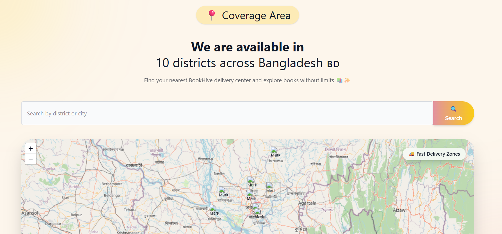

### Why Choose Us

### Featured Collection

### Testimonials
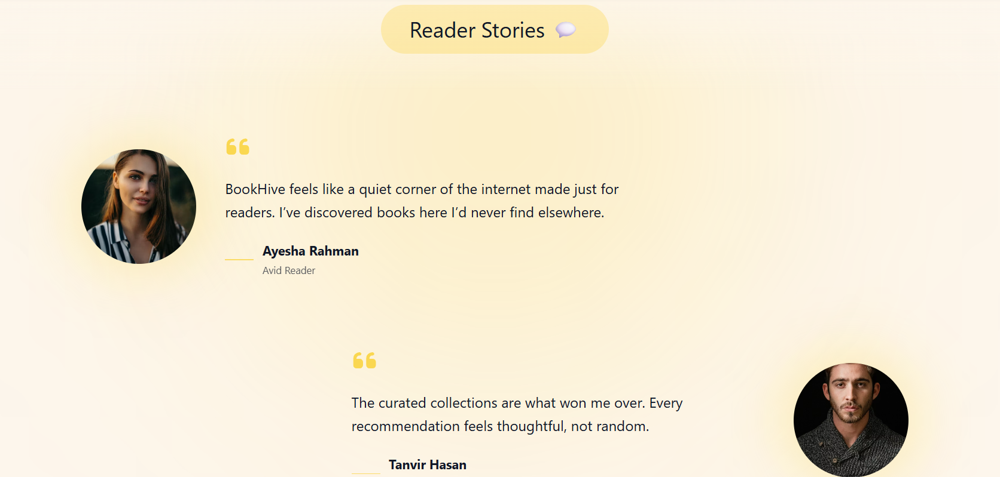

### How It Works

### Librarians

---

## 👤 User Side

### All Books
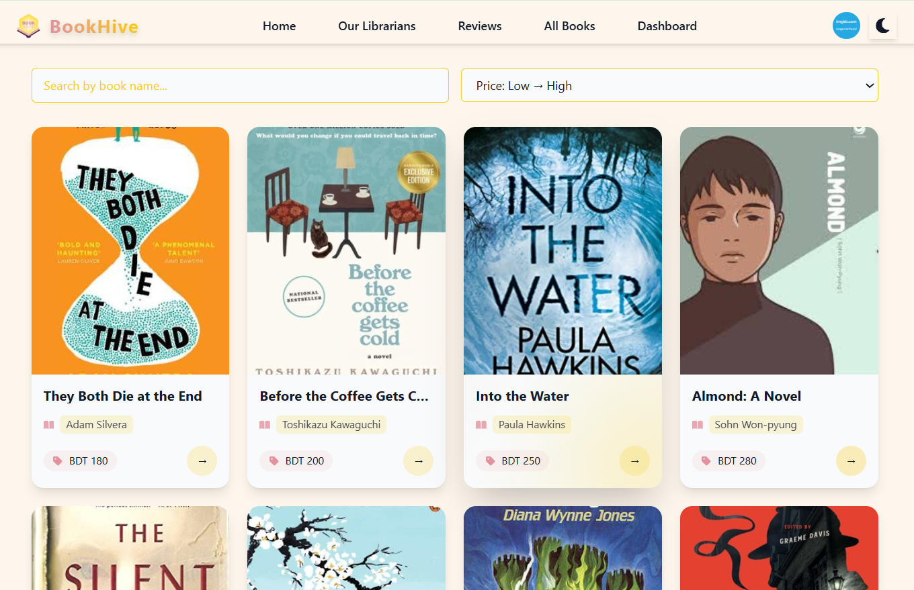

### Book Details
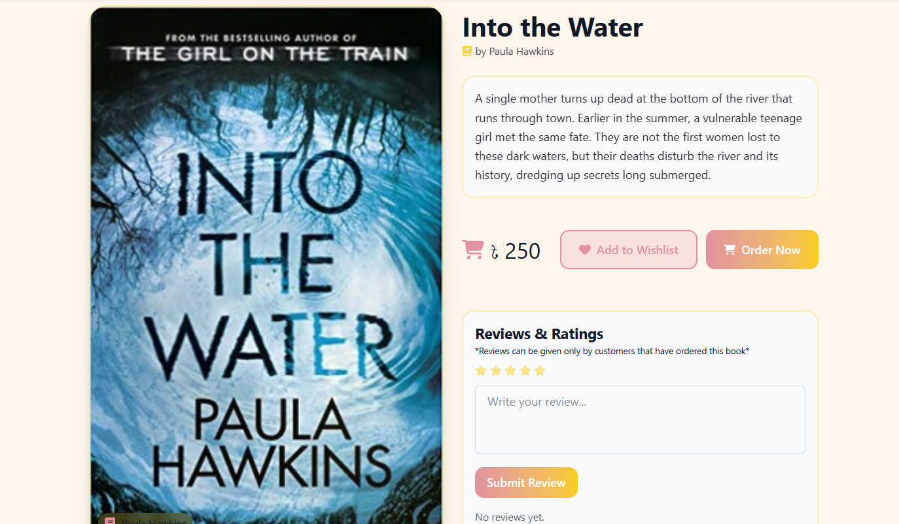

### User Profile
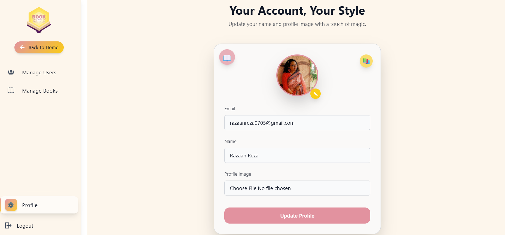

### Wishlist
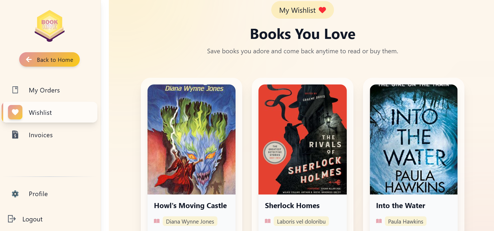

### User Orders
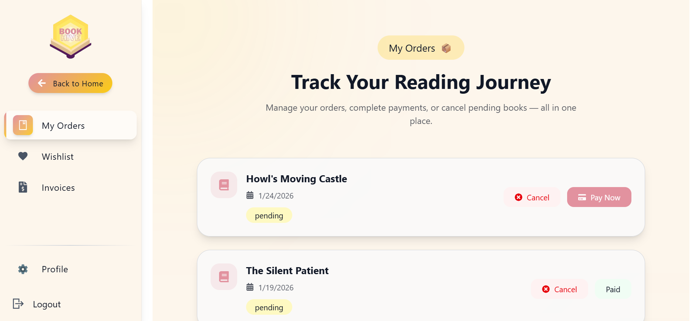

### Order Details
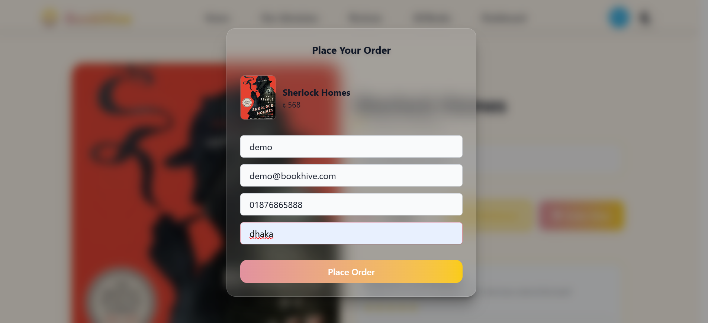

### Invoices
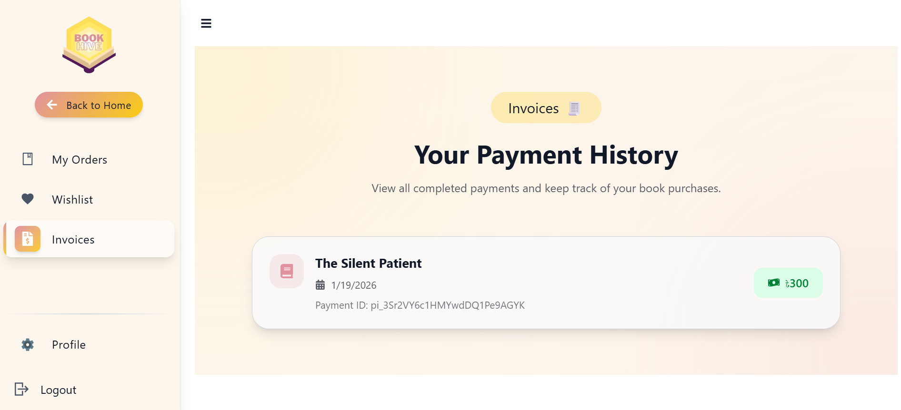

### Payment (Stripe)
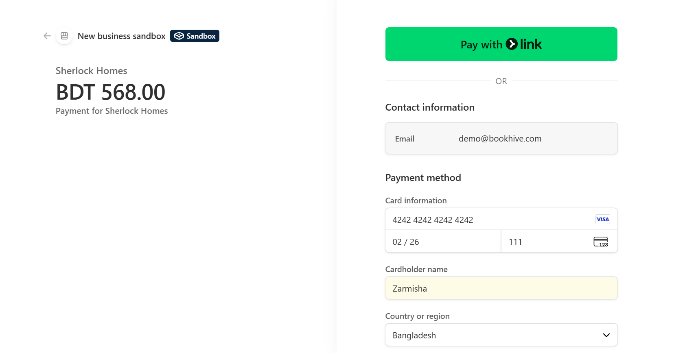

### Payment Success
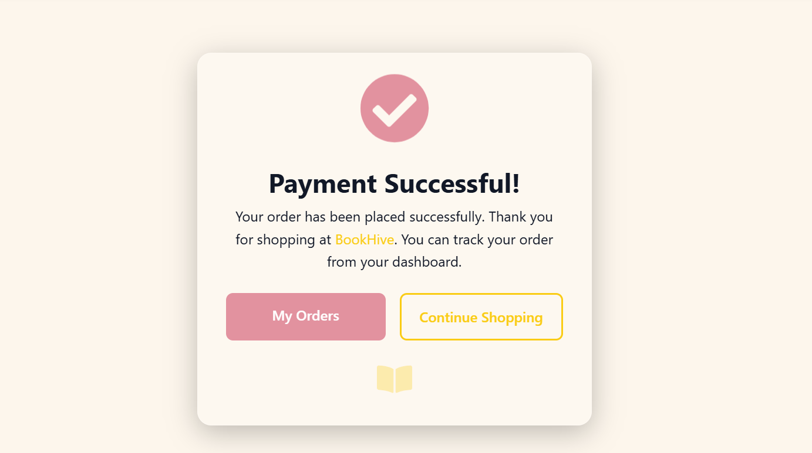

---

## 🛠️ Admin Side

### Manage Users
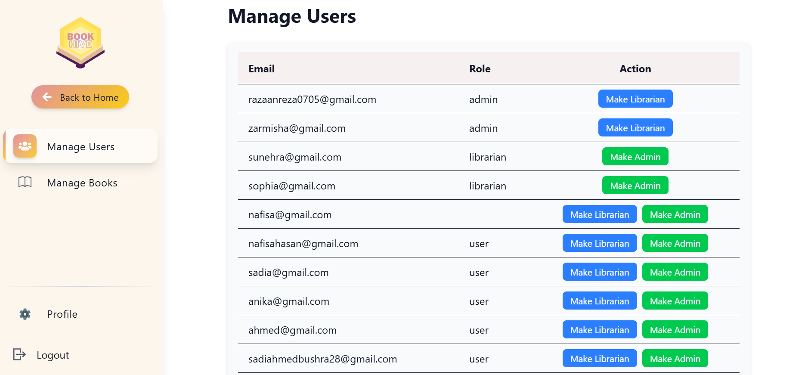

### Manage Books
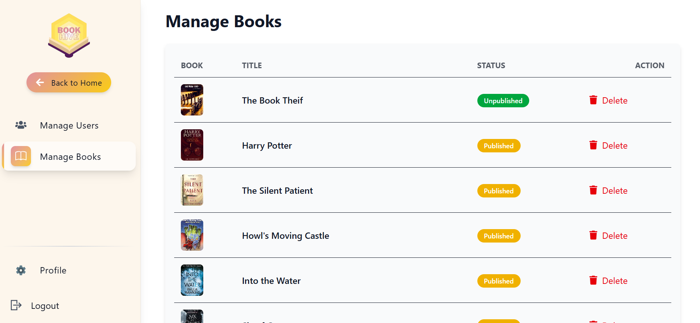

---

## 📚 Librarian Side

### Add Book
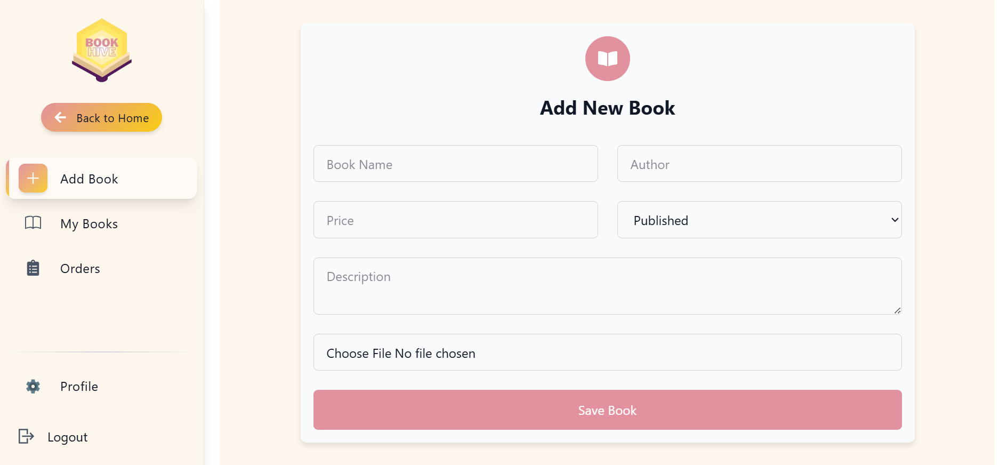

### My Books
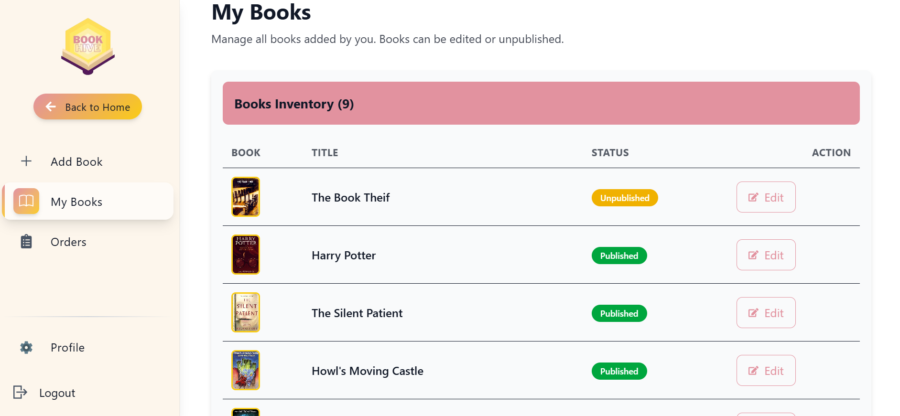

### Confirm Orders
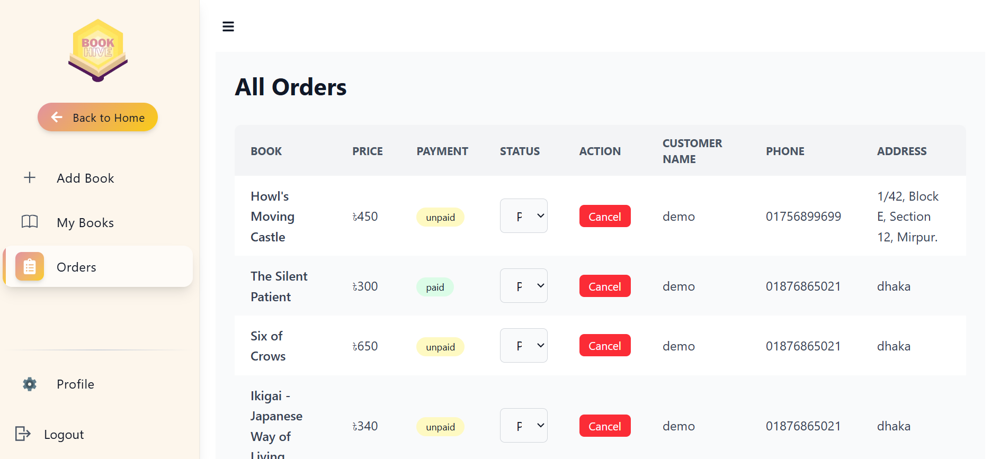